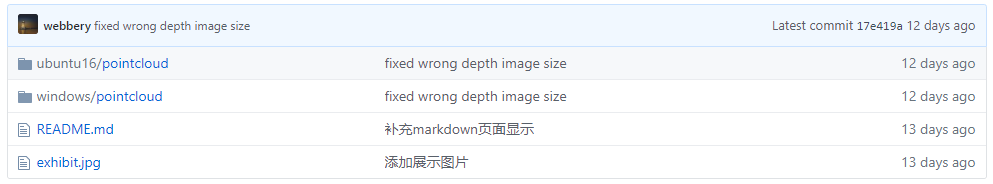
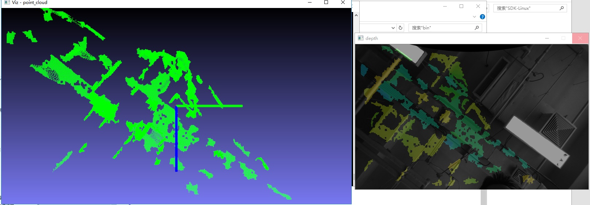

.. _pointcloud插件:

pointcloud插件
=====================

.. note:: 
  本插件按照SDK插件规范开发，提供深度图及点云功能

插件下载
^^^^^^^^^^^^^^^^^^^^^^^^^^^^^^^^

.. tip:: 

  下载地址：
  https://github.com/INDEMIND/plugin_pointcloud

 
▶ windows

将windows下的pointcloud文件夹完整的复制到SDK的plugin文件夹下，即可使用

▶ ubuntu 16

将ubuntu16下的pointcloud文件夹复制到SDK的plugin文件夹下，然后把libimpc.so复制到与libindem.so同级的目录（或者系统目录等程序能够在运行时加载的位置）下

使用插件
^^^^^^^^^^^^^^^^^^^^^^^^^^^^^^^^

a)查看版本

通过SDK来查看本插件的版本信息

.. code-block:: javascript

  int iMajor,iMinor;
  char developer[64]={0};
  CIMRSDK::ListPluginInfo("pointcloud",&iMajor,&iMinor,developer);

b）获取参数信息

在使用回调函数之前，需要获取图像大小的参数信息

.. code-block:: javascript

  struct CommandParams {
  int16_t width;
  int16_t height;
  char distortion_model[16];
  double P[12];
   };
  CommandParams params = { 0 };
  pSDK->InvokePluginMethod("pointcloud", "getParams", NULL, &params);

c）获取深度图和点云

.. code-block:: javascript

  void CloudDataCallback(int ret, void* pData, void* pParam) {
  DepthData* depthData = (DepthData*)pData;
  }

其中pData参数是形如 ``DepthData`` 的一个结构体

.. code-block:: javascript

  struct point_xyz {
  float x;
  float y;
  float z;
  float a;
  };
  struct DepthData {
  double _time;
  unsigned char* _depthImage;  //深度图,长度为图像的大小width*height
  size_t _number;		//点云的数量
  point_xyz* _points;		//指向点云的指针
  };

然后通过SDK注册回调函数获取深度图和点云数据

.. code-block:: javascript

  pSDK->AddPluginCallback("pointcloud", "depth", CloudDataCallback, NULL);

回调函数会拿到点云数据和深度图数据

d）配置文件

.. code-block:: javascript

  {
  "enable": true,
  "display": true
  }

display参数控制插件内部是否显示深度图，enable参数控制插件内部是否开启算法

编译执行
^^^^^^^^^^^^^^^^^^^^^^^^^^^^^^^^

.. tip:: 

  本插件需安装SDK及其依赖库、Opencv 3.4.3

将Pointcloud插件中Ubuntu 16下pointcloud文件夹拷贝至……SDK/lib/1604/plugin下

并将pointcloud文件夹中libimpc.so文件拷贝至……SDK/lib/1604中

进入……SDK/Demo，打开终端，输入如下命令行

.. code-block:: javascript

  mkdir build
  cd build
  cmake ..
  make

进入……SDK/lib/1604，打开终端，执行

.. code-block:: javascript

  sudo –s
  sudo chmod 777 *
  ./TestIndem.sh

即可得到深度及点云图像