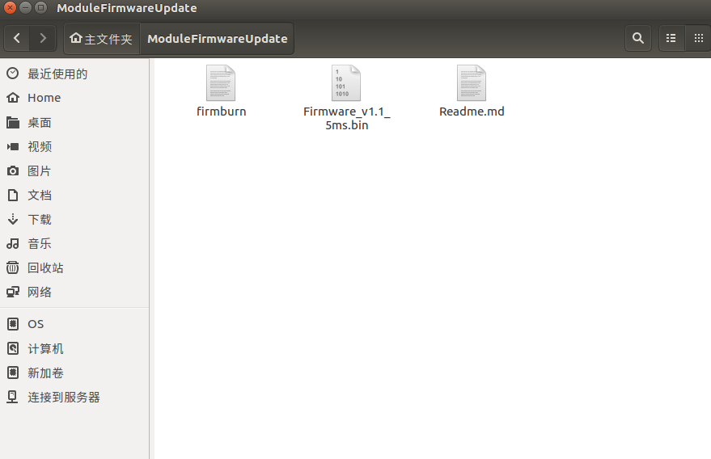
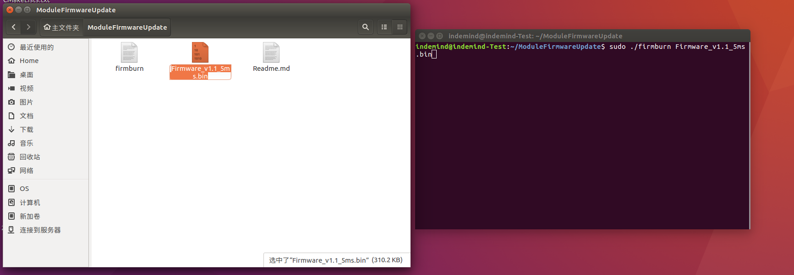
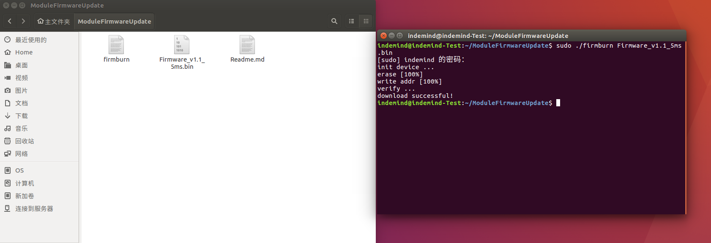

.. _chajian_chajianjiekou:

固件升级教程
==================

运行环境：Linux 系统 x86_64 平台（建议使用Ubuntu 16.04或18.04）

固件下载
^^^^^^^^^^^^^^^^^^^^^^^^^^^^^^^

.. tip:: 

  下载地址：
  https://github.com/INDEMIND/ModuleFirmwareUpdate

固件升级
^^^^^^^^^^^^^^^^^^^^^^^^^^^^^^^

1. 将模组插入到PC USB 3.0接口

2. 打开终端

3. 输入 “sudo ./firmburn 固件名称” 烧录固件，如：

.. code-block:: javascript

  sudo ./firmburn Firmware_v1.1.bin

4. 等待终端输出 “download successful!” 代表下载成功, 下载失败请参考 “下载失败情况及处理办法” 进行操作

5. 更新完成后，重新插拔设备，即可。

升级失败情况及处理办法
^^^^^^^^^^^^^^^^^^^^^^^^^^^^^^^

1. 出现 ``download failed!`` 请根据“固件更新方法”步骤3，使用固件更新命令，直至出现 ``download successful!`` 

2. 出现 ``Please use "sudo ./firmburn binfile" to burn bin file !!!`` 下载命令错误，请根据"固件更新方法“步骤3使用固件更新命令

3. 出现 ``Please re-plug the device !!!!`` 

需要重新插拔设备，再次按照“固件更新方法”中的步骤3-4执行，若再次出现此错误提示，重新插拔设备后输入烧录命令再次烧录即可

4. 出现 ``xxx file is not correct!!!`` 说明固件非indemind提供的固件或下载过程中出错，导致文件不完整, 需要重新下载固件(bin文件)

