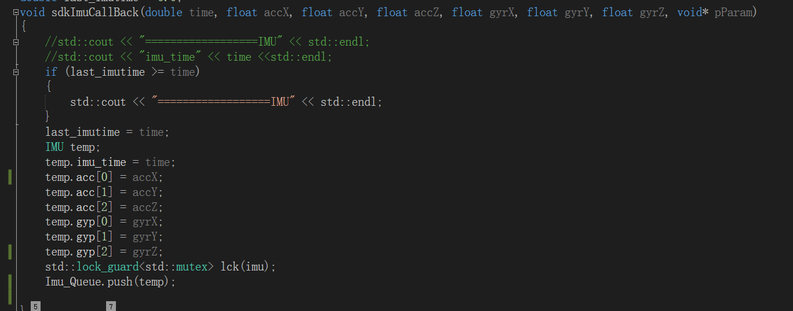

.. _huoquIMUshuju:

获取IMU数据
==================

该部分需要通过SDK调用IMU回调函数获取补偿后的IMU数据，具体如下：

定义回调函数

.. code-block:: C++

  void IMUCallback(double time, float accX, float accY, float accZ, float gyrX, float gyrY, float gyrZ, void* pParam){} 

调用回调函数

.. code-block:: C++

  pSDK->RegistModuleIMUCallback(IMUCallback,param); 

.. tip:: 
  获取IMU补偿数据：时间，单位：s；陀螺XYZ，陀螺单位：°/s；加速度计XYZ，加速度计单位：g（g0取9.8019967）。