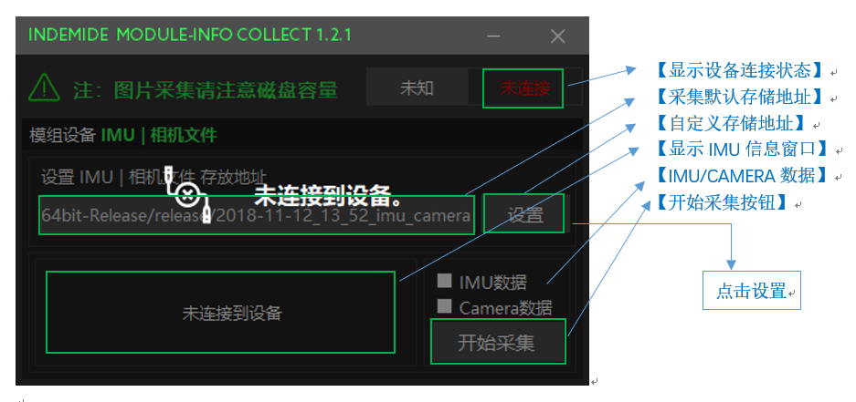
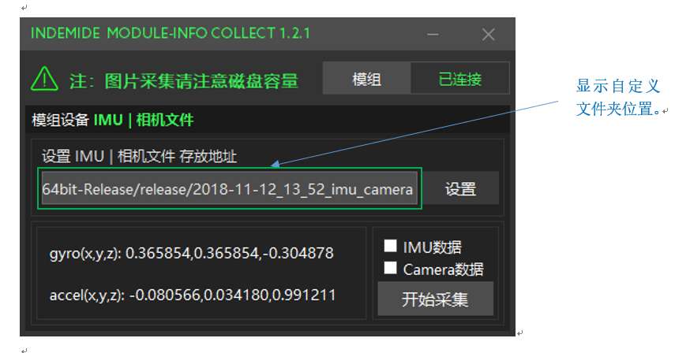
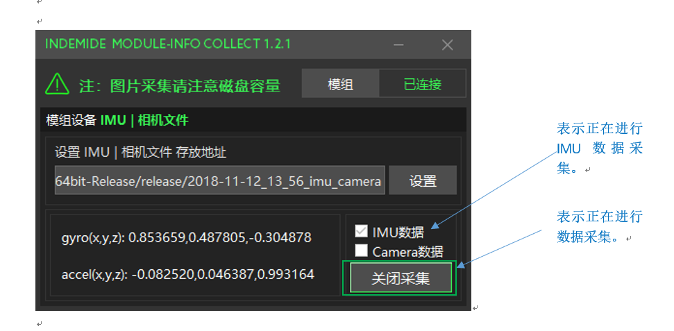
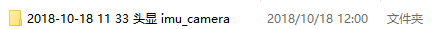
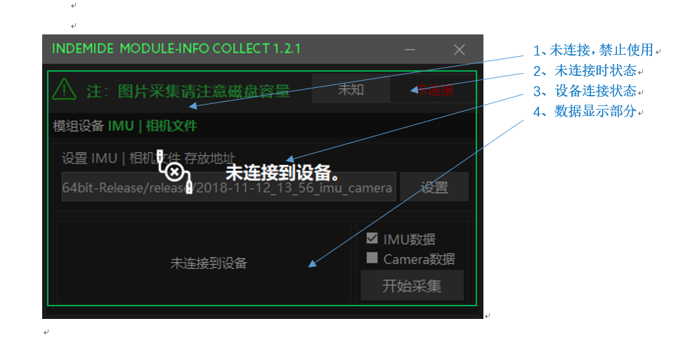

.. _analytics_stamp:

软件说明
============

主操作页
^^^^^^^^^^^^^^^^^^^^^^^^^^^^^^^^^^^^

数据存储路径设置
^^^^^^^^^^^^^^^^^^^^^^^^^^^^^^^^^^^^

点击设置按钮弹出选择文件存储位置窗口，根据需要自定义文件存储位置。

.. image:: ../../tupian/SDK_22.png

设置完成后如下图所示：

数据采集
^^^^^^^^^^^^^^^^^^^^^^^^^^^^^^^^^^^^

点击 开始采集 按钮，未设置自定义文件存储位置的前提下，会在软件同级目录下生成以当前日期命名的文件夹，如果事先已经设置，则会在用户期望生成的文件目录下生成对应的文件夹。

软件提供 IMU数据、Camera数据单独存储，以及同时存储的功能，请根据需要选择需要存储的数据（需要注意的是：文件夹以分钟为单位创建，同一文件相同时刻会内，采集的数据会追加在当时的文件夹内。）。

.. warning:: 

  1分钟约3G的数据容量，届时请注意内存。

默认会在软件目录下生成

自定义会在需要生成的位置生成

.. image:: ../../tupian/SDK_26.png

一、	cam0文件夹存储 左目摄像头采集的图像信息
二、	cam1文件夹存储 右目摄像头采集的图像信息
三、	imu0文件夹存储 模组设备的IMU信息存储

.. image:: ../../tupian/SDK_27.png

设备失联
^^^^^^^^^^^^^^^^^^^^^^^^^^^^^^^^^^^^

当模组设备未连接时，会显示设备如下图所示状态：

图像显示
^^^^^^^^^^^^^^^^^^^^^^^^^^^^^^^^^^^^

双目摄像头显示部分/Linux

.. image:: ../../tupian/SDK_29.png

